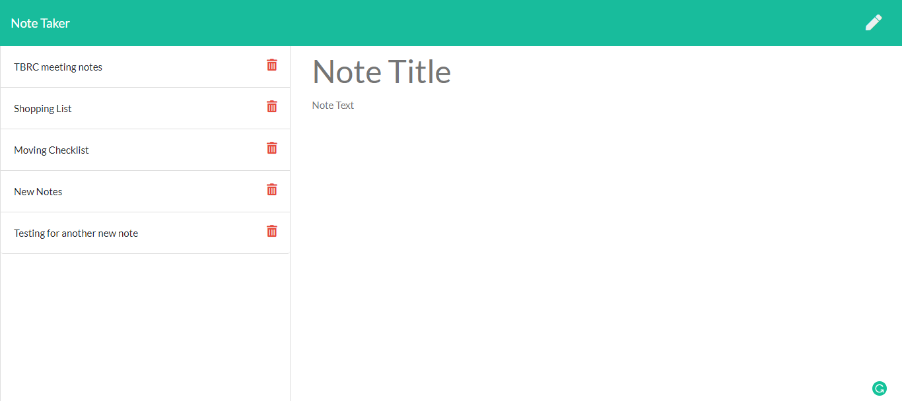

# Note Taker

## Description

Write and save notes on server

## Contribution

Made with ❤️ by Ruohan basing on HTML & CSS template from Xander Rapstine

## License

MIT

## Badges

## Screenshot

## GitHub

My GitHub link: (https://github.com/rhw-git/Note-Taker)

## Heroku

My GitHub link: (https://enigmatic-beach-18559.herokuapp.com)

## Contact

You can reach me by email: (ruohanw89@gmail.com)

## Tests

see tests in **test** folder
